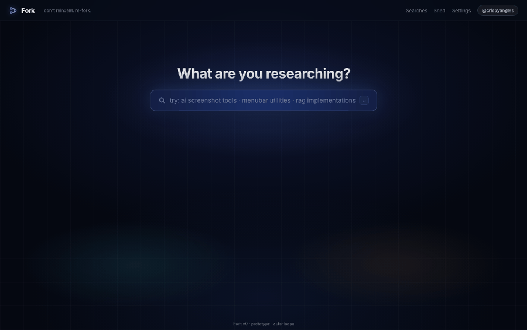
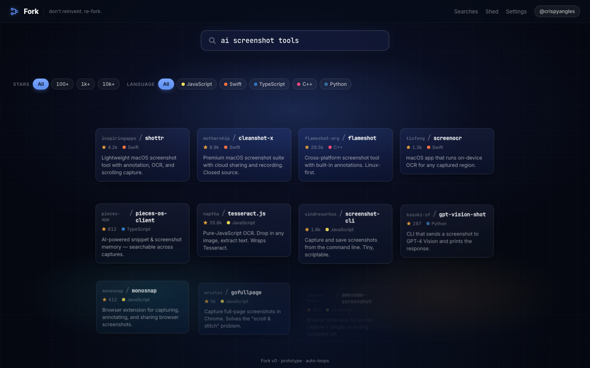
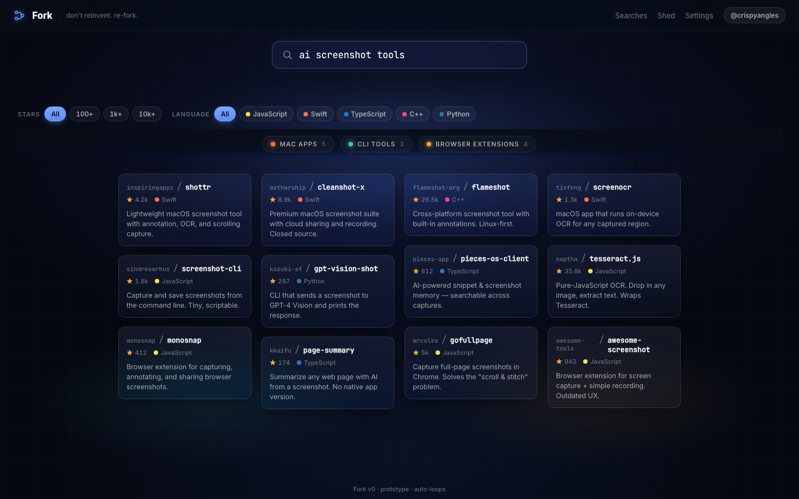
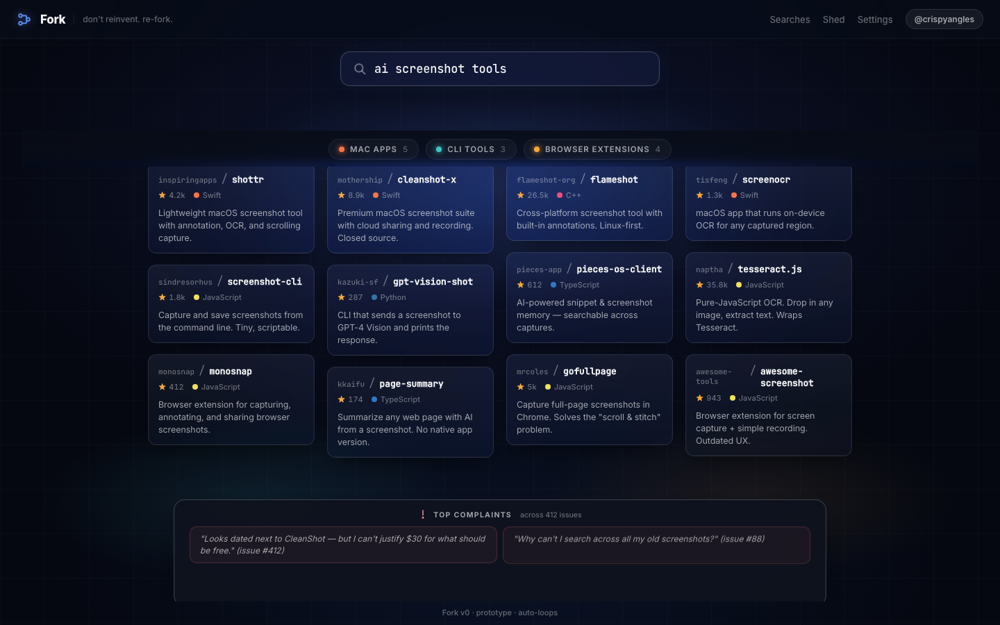
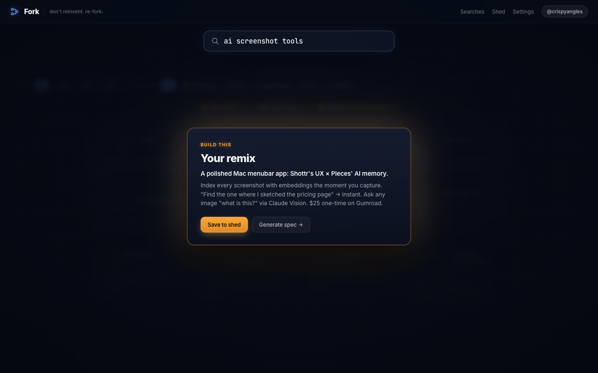
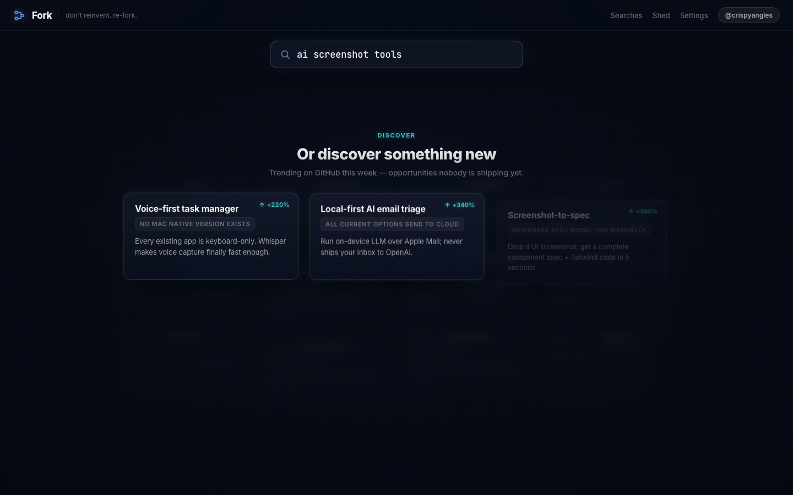

<div align="center">

# Fork &nbsp;·&nbsp; don't reinvent. re-fork.

**A beautiful research tool for builders.**  
Type any topic → see what's already on GitHub → find the niche nobody's filling.

▶ **[Try it live](https://crispyangles.github.io/fork-prototype)** &nbsp;·&nbsp; [](LICENSE)

<br>



</div>

---

## What it is

Fork is a single-page research tool that turns GitHub into a market-research layer. You type a topic, it pulls real repos from the GitHub API, clusters them by type, surfaces the top complaints from their issue trackers, then synthesizes a gap you could actually build.

It runs as a 30-second animated demo loop out of the box. Click the search bar at any point and it switches to live GitHub search.

<!-- TODO: user fill this in — 2 sentences about why you built this and what itch it scratches -->

---

## Try it

**Live demo:** `https://crispyangles.github.io/fork-prototype`

**Or run locally — no install needed:**

```bash
git clone https://github.com/crispyangles/fork-prototype
cd fork-prototype
npx serve .          # or: python3 -m http.server 8080
# open http://localhost:8080
```

---

## Features

- **9-phase animated demo loop** — empty → typing → loading → results → clustered → pain → climax → remix → discover
- **Live GitHub search** — real API calls, deduplication, auto-broadening for sparse results
- **Masonry card layout** — JS-positioned, no CSS grid hacks; no overlaps across 1440/768/390px viewports
- **Cluster view** — repos grouped by type (Mac apps, CLI tools, browser extensions…) with filterable headers
- **Pain panel** — surfaces the top complaints mined from a topic's GitHub issues
- **Synthesis cards** — gap analysis + a concrete "build this" remix idea
- **Discover mode** — trending opportunity cards for when you don't have a topic yet
- **Shed** — bookmark repos for later (persisted to localStorage)
- **Search history** — recent queries, keyboard-navigable
- **Global Escape** — resets search from anywhere
- **Zero backend, zero build step** — pure HTML/CSS/JS, drop on any static host

---

## Screenshots

| Results grid | Clustered view | Pain panel |
|:---:|:---:|:---:|
|  |  |  |

| Synthesis | Discover |
|:---:|:---:|
|  |  |

---

## Stack

Vanilla HTML + CSS + JS — no build step, no framework, no dependencies.

| File | Role |
|------|------|
| `index.html` | Markup, CSP header |
| `style.css` | Dark design system; `body[data-phase]`-driven layout |
| `app.js` | Phase machine, masonry layout, GitHub API, Shed, history |
| `data/fake-repos.js` | Scripted demo data (repos, pain points, gap analysis) |

---

## License

MIT © 2026 Reese Munoz
